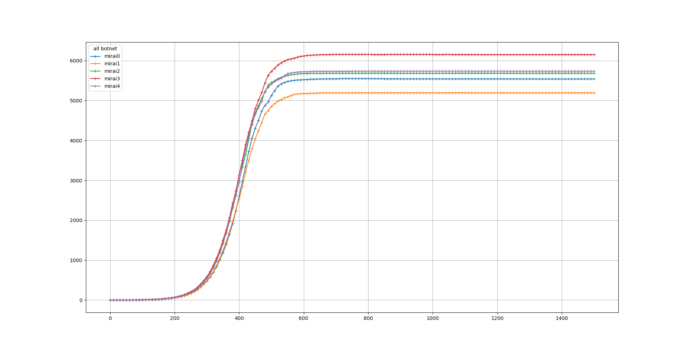
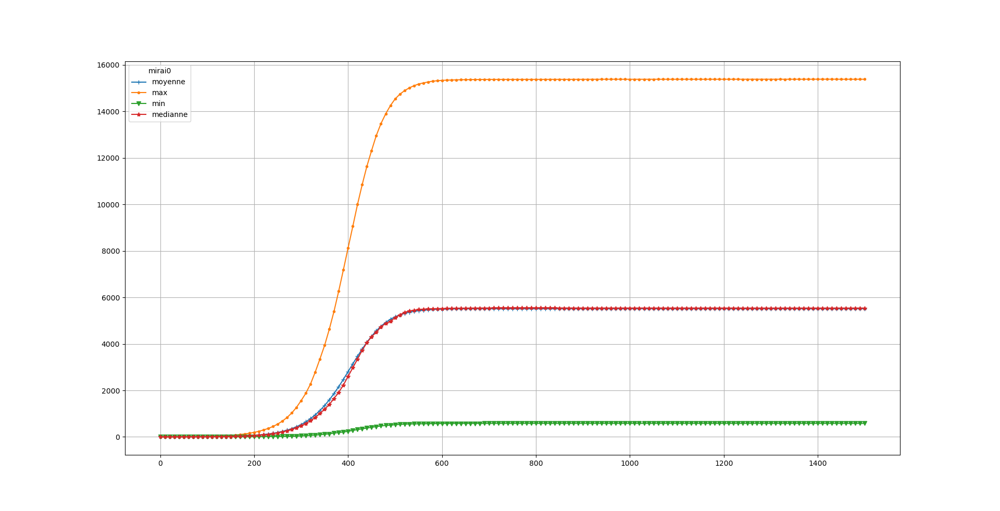
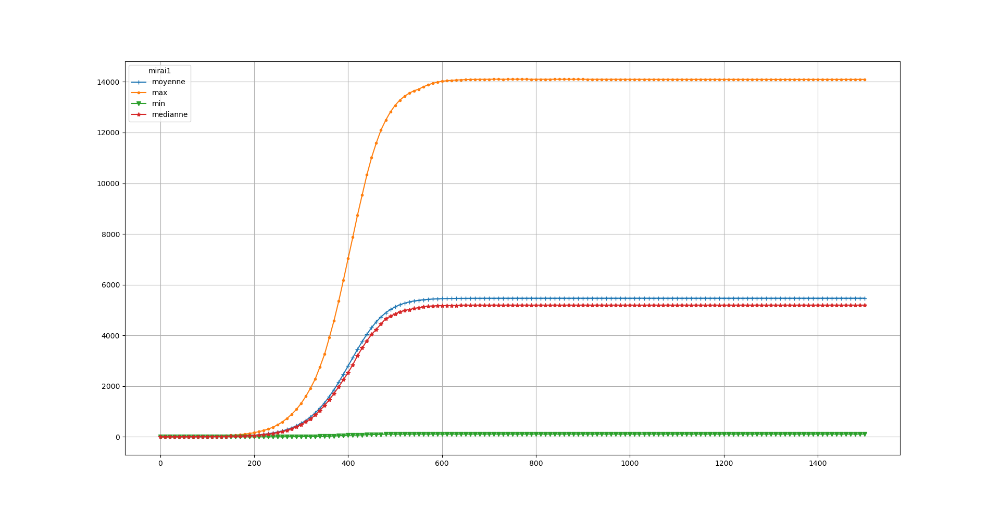
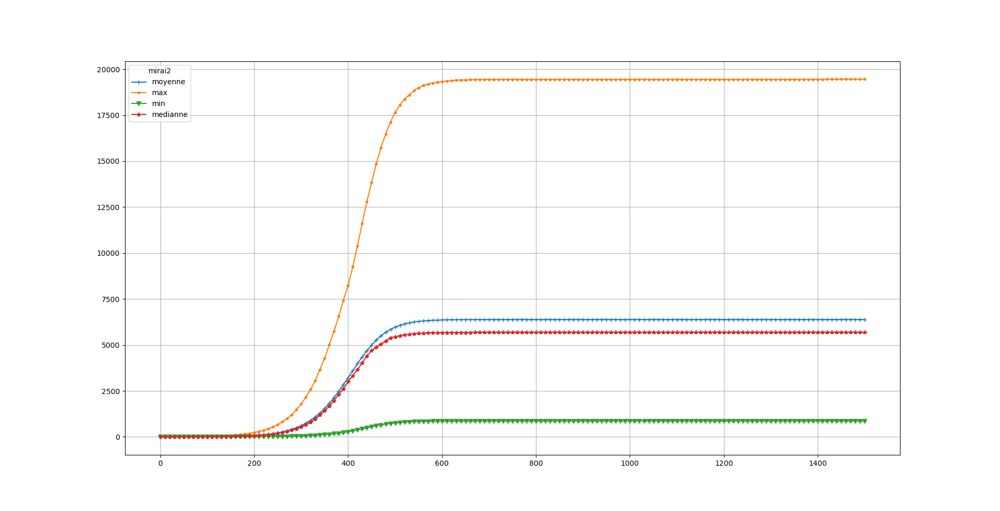
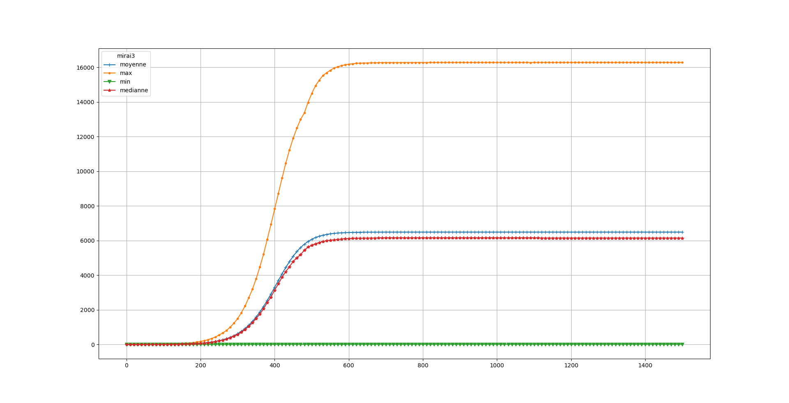
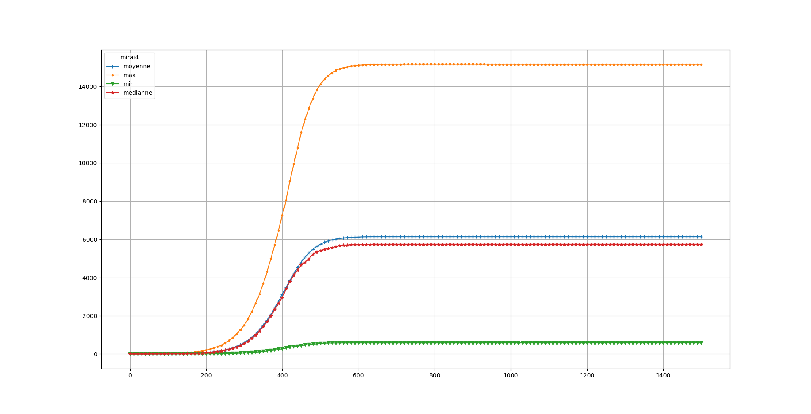

# EXP 1A 

For this experience, we made something quite simple : 5 identicals botnets, with random scan, starting at the same time and providing immunity against all other botnets.
The simulation ran for 1500 turns.

This experience show the hight variation between each simulation, a botnet could infect most of victims or very few. 

Median size of all botnets over the time

Maximum, Minimum, Mean and Median size of botnet #0 over the time

Maximum, Minimum, Mean and Median size of botnet #1 over the time

Maximum, Minimum, Mean and Median size of botnet #2 over the time

Maximum, Minimum, Mean and Median size of botnet #3 over the time

Maximum, Minimum, Mean and Median size of botnet #4 over the time

