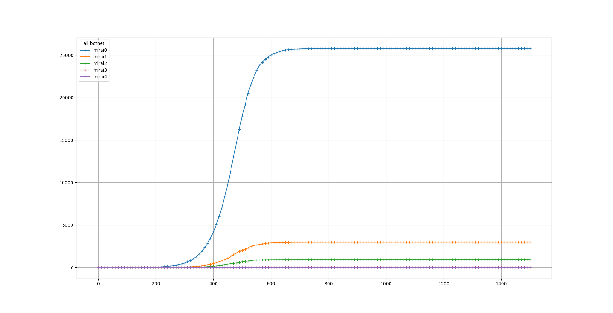
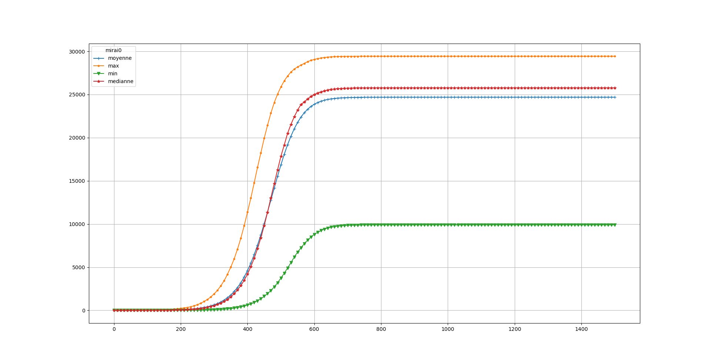
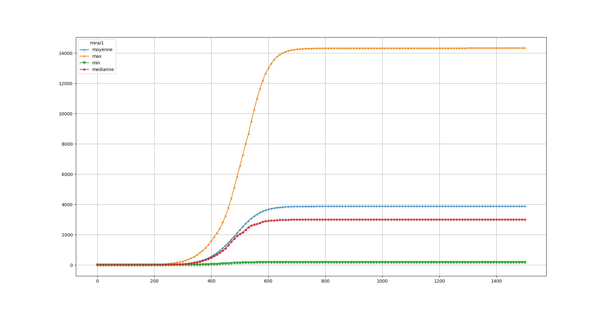
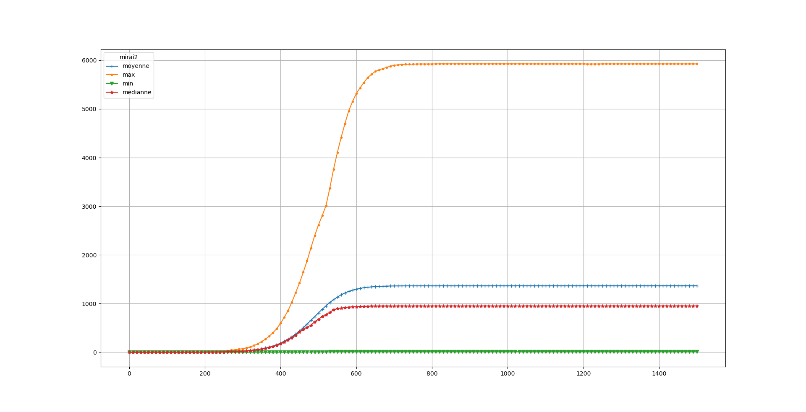
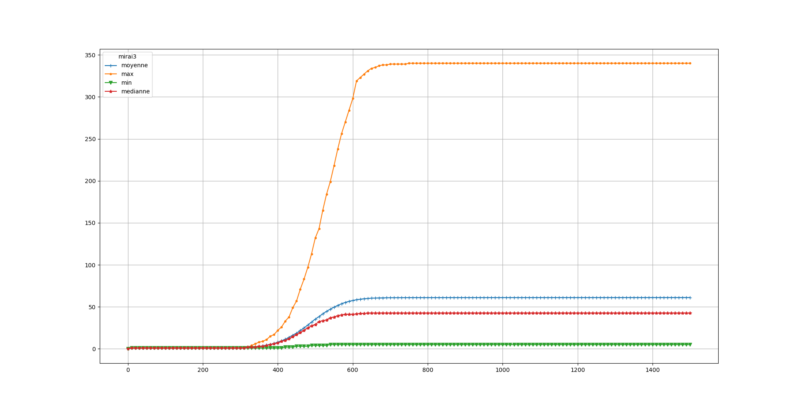

# EXP 1B

The parameters for this experience are the same than for exp 1A exept that botnet after botnet #0 start with a delay. 

| Botnet        | Scan Methods  | IP generation time  | Test time | Exploit Time | Removing | immunity         | start (t)|
|:-------------:|:-------------:|:-------------------:|:----------|:------------:|:--------:|:----------------:|:--------:|
| Botnet #0     | random        | 3                   | 5         |   4          | none     | #0 #1 #2 #3 #4 #5|   0      | 
| Botnet #1     | random        | 3                   | 5         |   4          | none     | #0 #1 #2 #3 #4 #5|  100     | 
| Botnet #2     | random        | 3                   | 5         |   4          | none     | #0 #1 #2 #3 #4 #5|  150     | 
| Botnet #3     | random        | 3                   | 5         |   4          | none     | #0 #1 #2 #3 #4 #5|  300     | 
| Botnet #4     | random        | 3                   | 5         |   4          | none     | #0 #1 #2 #3 #4 #5|  1000    | 

Median size of all botnets over the time

Maximum, Minimum, Mean and Median size of botnet #0 over the time

Maximum, Minimum, Mean and Median size of botnet #1 over the time

Maximum, Minimum, Mean and Median size of botnet #2 over the time

Maximum, Minimum, Mean and Median size of botnet #3 over the time

Maximum, Minimum, Mean and Median size of botnet #4 over the time