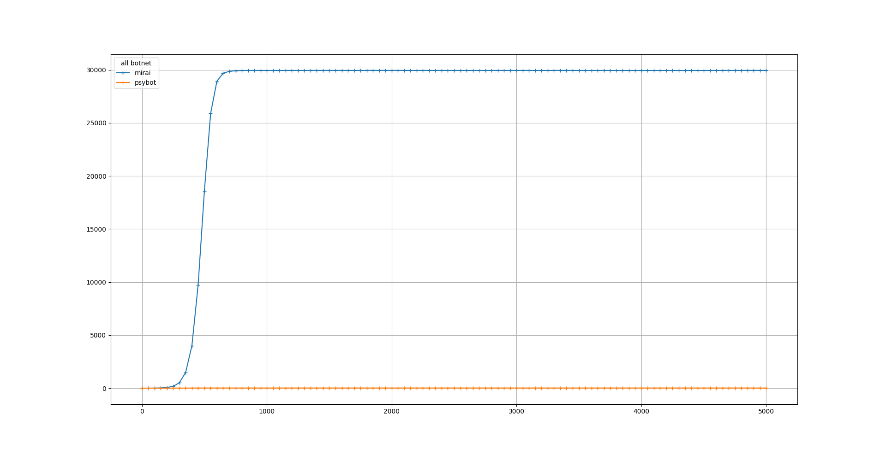

# EXP 2A

In this experience we wanted to observe the difference of efficiency between the random scan and the sequential scan. We ran the simulation over 1000 and 5000 turns. Results are similary.  

| Botnet        | Scan Methods  | IP generation time  | Test time | Exploit Time | Removing | immunity         | start (t)|
|:-------------:|:-------------:|:-------------------:|:----------|:------------:|:--------:|:----------------:|:--------:|
| Botnet #0     | Seuqential    | 1                   | 5         |   4          | none     | #0 #1            |   0      | 
| Botnet #1     | random        | 3                   | 5         |   4          | none     | #0 #1            |  0       | 

Median size of all botnets over the time, 5000 turns

Zoom of the previous figure

Maximum, Minimum, Mean and Median size of botnet #0 over the time

Maximum, Minimum, Mean and Median size of botnet #1 over the time

