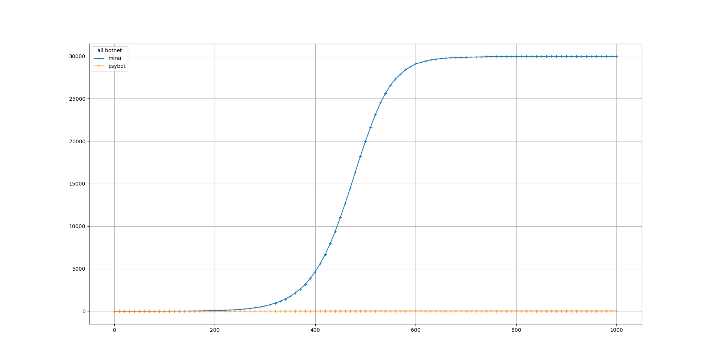
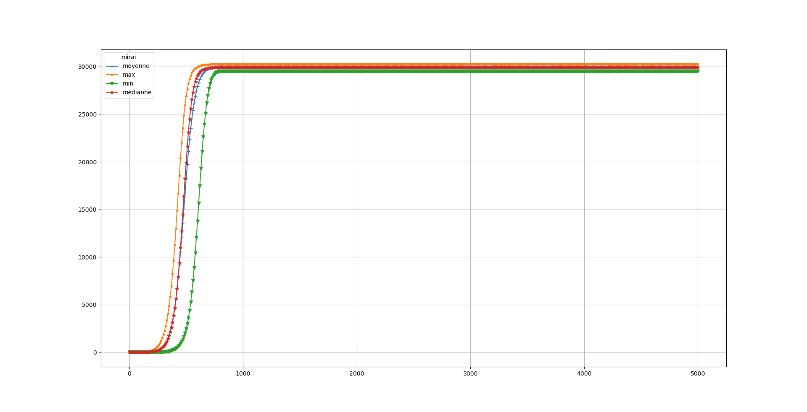

# EXP 2B

In this experience we wanted to observe the difference of efficiency between the random scan and the sequential scan. We ran the simulation over 1000 and 5000 turns. Results are similary. The difference with the exp 2A is the IP generation Time, test time and Exploit time, they are at the minimum for the botnet 0. Results are similar with EXP 2A.

| Botnet        | Scan Methods  | IP generation time  | Test time | Exploit Time | Removing | immunity         | start (t)|
|:-------------:|:-------------:|:-------------------:|:----------|:------------:|:--------:|:----------------:|:--------:|
| Botnet #0     | Seuqential    | 1                   | 1         |   1          | none     | #0 #1            |   0      | 
| Botnet #1     | random        | 3                   | 5         |   4          | none     | #0 #1            |  0       | 

Median size of all botnets over the time, 5000 turns

Maximum, Minimum, Mean and Median size of botnet #0 over the time

Maximum, Minimum, Mean and Median size of botnet #1 over the time

