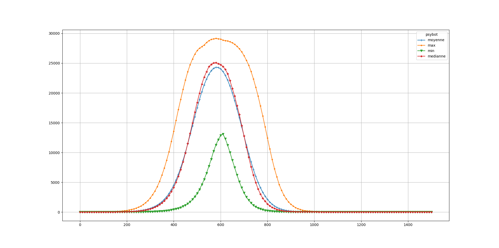
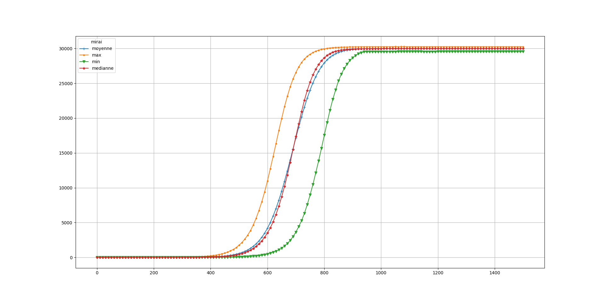

# EXP 3A

In this experience we wanted to observe the impact of removing other botnet. Some IoT botnet such as Wifatch do this. To do this experience, we use two botnet with the same time for each state, but the 1st one cannot provide any imunity. The second botnet is able to remove the first one.  the second botnet start with a delay of 200 turns. The simulations ran for 1500 turns.

| Botnet        | Scan Methods  | IP generation time  | Test time | Exploit Time | Removing | immunity         | start (t)|
|:-------------:|:-------------:|:-------------------:|:----------|:------------:|:--------:|:----------------:|:--------:|
| Botnet #0     | random        | 3                   | 5         |   4          | none     | none             |   0      | 
| Botnet #1     | random        | 3                   | 5         |   4          | none     | #0 #1            |  200     | 

Median size of all botnets over the time, 5000 turns

Maximum, Minimum, Mean and Median size of botnet #0 over the time

Maximum, Minimum, Mean and Median size of botnet #1 over the time

