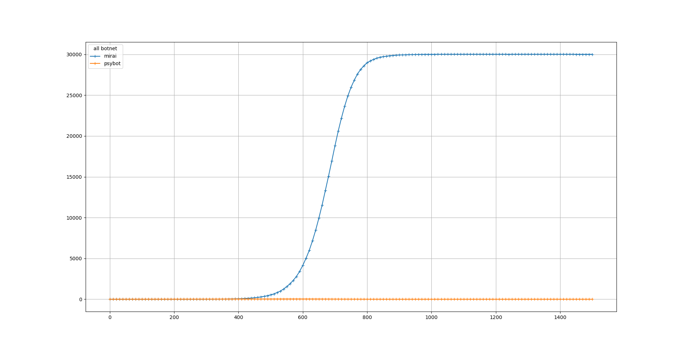
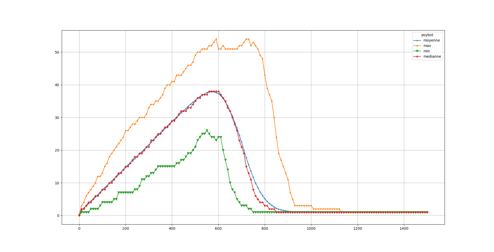
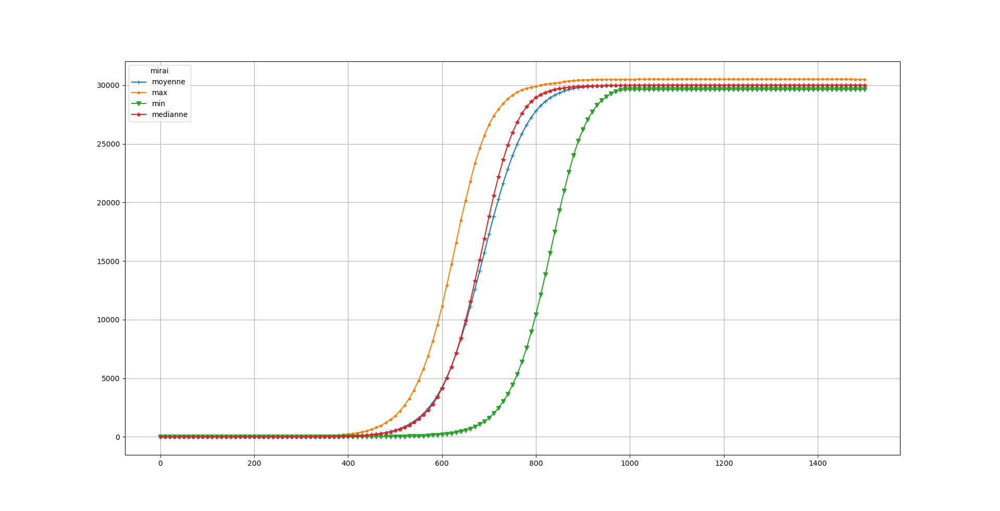

# EXP 3B

This experience use the same parameters than the EXP 3A but we reduce the time needed for each state.

| Botnet        | Scan Methods  | IP generation time  | Test time | Exploit Time | Removing | immunity         | start (t)|
|:-------------:|:-------------:|:-------------------:|:----------|:------------:|:--------:|:----------------:|:--------:|
| Botnet #0     | random        | 3                   | 5         |   4          | none     | none             |   0      | 
| Botnet #1     | random        | 3                   | 5         |   4          | none     | #0 #1            |  200     | 

Median size of all botnets over the time, 5000 turns

Maximum, Minimum, Mean and Median size of botnet #0 over the time

Maximum, Minimum, Mean and Median size of botnet #1 over the time

